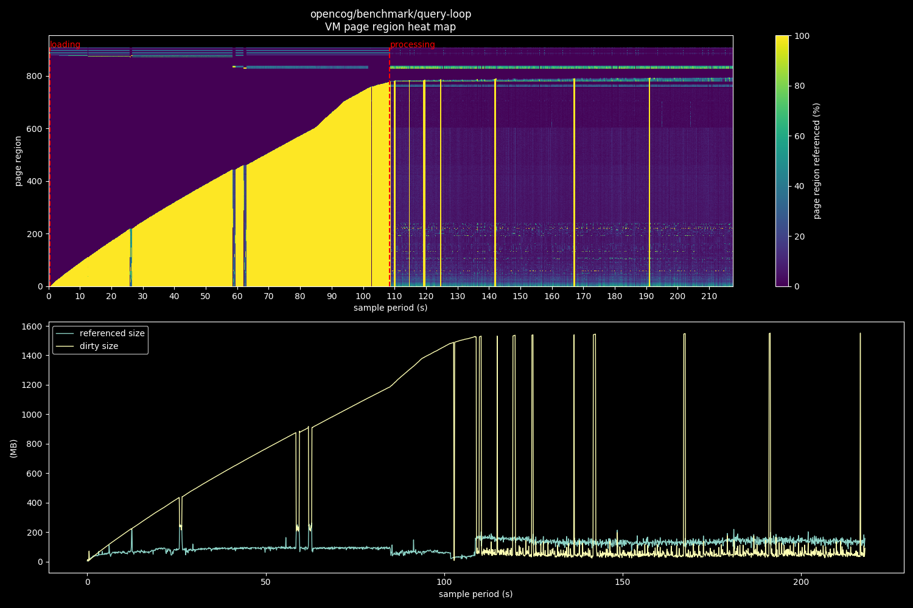

*warning - preliminary results - warning*

These are experiments to verify certain important assumptions if one wants to
use memory-mapped files on SSD as transparent Opencog atomspace storage. For
more info see
[discussion](https://groups.google.com/g/opencog/c/viLaTaIEmYY/m/z4rQzofsAAAJ)
on opencog mailing list.

### Referenced VM page heatmap ### 

Linux kernel is patched by applying
[this](linux-5.8.0-page-referenced-flag-in-procfs-pagemap.patch). This allows
reading of YOUNG/ACCESSED memory page flags through `/proc/PID/pagemap` file,
indicating which pages are referenced since last request to clear reference
bits (`/proc/PID/clear_refs`).

Patched kernel is running in QEMU virtual machine with 2 CPU cores, 2GB RAM,
without swap.

Pagemaps of single thread Guile scheme process executing
[query-loop](https://github.com/opencog/benchmark/tree/master/query-loop)
benchmark are logged by [pagemap reader python
script](vm-page-flags-capture.py). Output is binary log file with captured
pagemap data.

    $ cd benchmark/query-loop && .../mmaped-atomspace/run-query-loop.sh
    output_filename: query-loop.vmpf
    fifo_filename: marker.fifo
    period: 0.1
    cmd: ['guile', '-l', 'bio-loop.scm']
    page_size: 4096
    pid: 7338
    pagemap: @ 0.0s Tr:0.004s S:22M D:8M A:4M smD:1M smA:5M
    pagemap: @ 0.1s Tr:0.013s S:30M D:15M A:8M smD:3M smA:7M
    pagemap: @ 0.2s Tr:0.015s S:42M D:9M A:10M smD:6M smA:9M
    ...
    Triangle relations for 681 genes in 109.31 seconds
    VM page flags capture completed.

If you don't want to patch and compile Linux kernel you can download already
captured test data:

    ./ipfs-data get

Captured pagemap data is processed by [another
script](vm-page-heatmap-graphs.py) to generate following graphs.

    $ python vm-page-heatmap-graphs.py data/query-loop.vmpf
    loading pagemap samples...
    len(samples): 2176
    consolidating regions...
    len(rintervals): 9
    number of known memory pages: 454065
    markers: {'loading': 0.40195131301879883, 'processing': 108.6859245300293}
    saving accumulated_page_counts.png
    saving page_region_referenced__sample_period.png

After a lot of dirty pages during loading stage, page access activity
seems to reduce to ~8% very "hot" pages. But there is a long tail which if my
calculations are correct will probably **require SSD/Optane memory with low
latency** for this specific workload.

### Sparse memory-mapped files for "infinite" atomspace ###

It's possible to punch holes in local mmaped spare files to deallocate unused
memory blocks. The same should be possible with files on NFS (will be tested in
the future). [Test program](sparse-mmaped-file.c) output:

    $ ./sparse-mmaped-file
    patomspace: 0x75a54ea64000 (@ 120469 GB)

    * after create, write:
    -rw-r--r-- 1 pr pr 10T Aug 14 22:37 atomspace
    10M    atomspace

    * after hole punching (block deallocation):
    -rw-r--r-- 1 pr pr 10T Aug 14 22:37 atomspace
    0    atomspace

Output of [test program](find-max-mmaped-region-size.c) to find maximum size
of mmaped region on 64-bit Linux 4.19 system:

    $ ./find-max-mmaped-region-size
    max_mmap_size: 9.47201e+13 bytes (86.147 TB)

